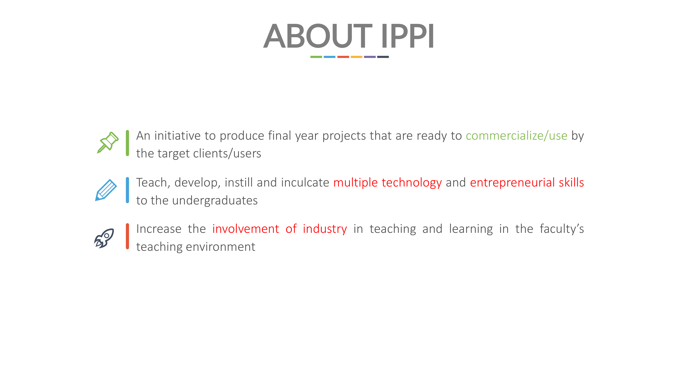
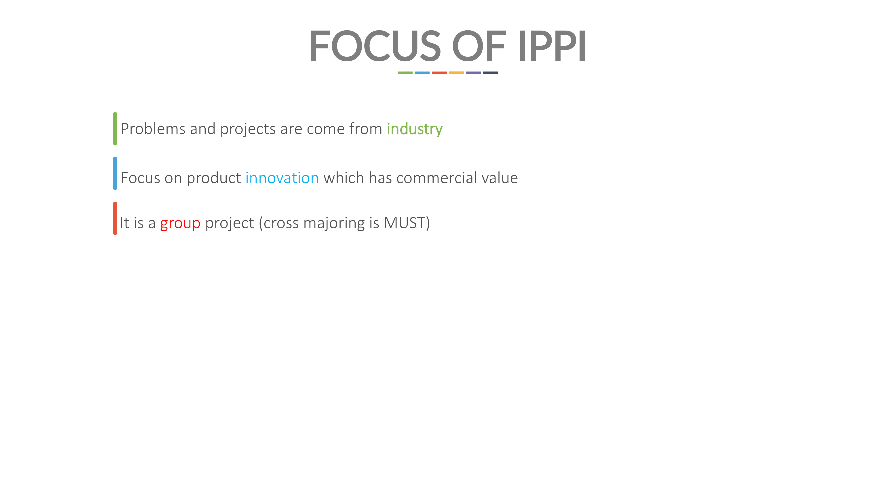

## Table of Contents

- [Table of Contents](#Table-of-Contents)
- [Introduction](#Introduction)
- [Part 1: Pre-FYP Preparation](#Part-1-Pre-FYP-Preparation)
	- [FYP1 vs. FYP2](#FYP1-vs-FYP2)
	- [IPPI vs, Conventional FYP](#IPPI-vs-Conventional-FYP)
	- [Solo vs. Duo vs. Group: Which is Better?](#Solo-vs-Duo-vs-Group-Which-is-Better)
	- [Choosing your Project Title](#Choosing-your-Project-Title)
	- [Choosing your Supervisor](#Choosing-your-Supervisor)
	- [Choosing Project Title vs. Supervisor: Which to Prioritise?](#Choosing-Project-Title-vs-Supervisor-Which-to-Prioritise)
- [Conclusion](#Conclusion)

---

## Introduction

This blog post provides a **comprehensive guide** and **walkthrough** of my **Final Year Project (FYP) experience** for the past 2 semesters. 

It is intended to not only **serve as reference** for those who will embark on a similar journey, but also to act as **proper documentation** for archiving all my knowledge and experience before memory fades (*I have a memory of a goldfish*).

Before that, full disclaimers:

1. **All views expressed in this post are my own**. This article showcases my own **subjective view** and apart from the backing of my own credibility, it does not represent the faculty's official recommendations or views whatsoever. 
2. My sharing is grounded or limited on the **context of FYP in FCSIT UM for Software Engineering department only** and may not be fully applicable to those from other institutions or even other disciplines of my own faculty.
3. The focus of this blog is more about sharing the things that are often **left out/only discovered after going through FYP** that I felt **everyone should know in advance/in hindsight** and less about the technical things that you will eventually be briefed by the faculty's FYP coordinator prior to the start of your FYP.
4. Please keep in mind that FYP like most subject matters can be incredibly **nuanced** and **no one single anecdote or guide** including this one can be **exhaustive and comprehensive enough** to cover everything.
5. If there are **any inaccuracies** in the information that is provided in this post or any future posts in the article series, please **do not hesitate** to **message me personally** and **correct me**.

This article series will be divided into several parts for easy readability, starting with the first one regarding **pre-FYP preparation**.

Without further ado, let's get right into it!

---

## Part 1: Pre-FYP Preparation

 

### FYP1 vs. FYP2

In case you don't know, FYP (or officially called as Academic Project in the course plan) in FCSIT UM is being **divided into 2 parts**: **Academic Project I** and **Academic Project II**. Throughout not only this blog post but also the entire article series, I will refer to these two with their colloquial terms FYP1 and FYP2 respectively. 

I will not go too deep into the details for the difference between the two, as everyone will eventually be briefed by the faculty's FYP coordinator regarding this, via [this PDF linked from the coordinator's personal site](http://hairulnizam.my/fyp/BriefingFYP1.pdf). Note that the contents of the slides are a bit outdated (it still uses screenshots of the old Ilmiah system) and therefore will be subjected to changes in the future.

The following is an excerpt of the slide showing an overview of the differences between FYP1 and FYP2:

As you can see, **FYP2** is being **allocated more credit hours (5)** compared to **FYP1 (3)**. This is because **most of the development of your system will occur during FYP2 instead of FYP1**, where you will mostly be dealing with literature review research and outline your project proposal. 

It is also expected for you to **take FYP1 and FYP2 during your 6th and 7th (final) semester** as outlined in the course plan, though this is **not set in stone** as there are others who may either take these courses early (due to postponing their industrial training) or later (going for exchange). Please also note that for FCSIT UM Data Science students, they will be taking their FYP first before undergoing their internship.

Finally, you can see the weightage for the evaluation for each course. **Both FYP1 and FYP2 have the same assessment components**, where **60%** will be evaluated by the **appointed panels** by each department FYP coordinator through your **final presentation** and **viva session** while the remaining **40%** will be **assessed entirely** by your own **supervisor** for the **final report submission**. 

Although FYP1 and FYP2 are separate courses, it **does not mean that you will conduct 2 separate projects**. Instead, it is a **continuous development** of a **single project** across the span of 2 semesters with **separate evaluations**. If you screw up your FYP1, you still have a chance to redeem yourself in FYP2.

I will spare the in-depth details regarding FYP1 and FYP2 in later parts of this article series. As I mentioned in my disclaimer, they will be focusing more on my experience. I will not go through much of the stuff that I'm sure that the faculty's FYP coordinator will brief further in detail and with more updated information later on. 

---

### IPPI vs, Conventional FYP

While almost everyone knows that FYP is divided into 2 separate courses, very few know that there are **2 types of FYP** that FCSIT UM students can undertake in the faculty. 

The first one is what I would call as a **conventional FYP** (or sometimes just known as normal FYP). This is what ~99% of students including myself will most likely take. 

The second type which is often unheard of until the day of FYP1 briefing is **Innovative Product Project Initiative (IPPI)**, a special FYP programme proposed by the faculty. It is an initiative to produce final year projects that are focusing more towards **product innovation**, prioritising on **commercialisation and marketability** through **active involvement with the industry**.

The following screenshots summarises IPPI. **IPPI projects must be conducted in a group** of usually **3-5 cross-majoring students** unlike normal FYP. **Cross-majoring** means that **all group members must come from different departments**. Because of the involvement of students from different departments, there will be multiple supervisors in a team as each student will have their own supervisor. 

The project title will also **come from industrial partners (usually big ones)**, therefore your stakeholders will also come from the industry. That is not the case for conventional FYP as the title will first be proposed by the supervisor and students can choose to collaborate with not just industrial representatives but also individuals from other organisations or domains as long as they can aid you in acquiring requirements for the project. 

The idea behind this implementation is that, **students from different disciplines can work together** and **combine their unique skill sets** to come up with an innovative project that is ready for commercialisation. 

For example, one of my friends from Software Engineering took IPPI as his FYP with collaboration with Malaysia Airports. In that project, he is in charge of developing the mobile application part of the system. The Artificial Intelligence department representative will develop a recommendation system while his teammate from Information Systems will handle the web application as well as data visualisation and analytics.

The following table shows the summary of the key differences between IPPI and conventional FYP:

As for which one is better, I cannot say for sure as I'm only limited to my experience in conducting my FYP conventionally. The biggest advantage of IPPI that I can see is the **valuable experience** that you can get from **collaborating directly and more closely with the industry**. Though, keep in mind that this is not unique to just IPPI per say as you can still collaborate with industrial representatives as your stakeholders for conventional FYP. 

In my opinion, you should only take IPPI if you are the type that not only prefers to work in group, but can handle the pressure of working alongside the industry. 

If you want to know about IPPI from a student's perspective, feel free to contact me personally for me to provide you my friend's contact number.

---

### Solo vs. Duo vs. Group: Which is Better?

One of the initial dilemmas *way before* the FYP journey even began (*as early as during my second year*) was deciding on whether I wanted to do my FYP **alone**, **together with a partner** or **in a group**. 

Some of my peers once remarked that they expected me to conduct my FYP solo because they felt that I seem to be the lone wolf type and I need not rely on anyone else since I'm fully capable of doing things on my own.

While their inference in correct; that my instinct is almost always to try and tackle things alone, I decided to go against my general preference for FYP and instead choosing to do it with a partner for a few reasons:

1. "*If you want to go fast, go alone. If you want to go far, go together*"
	 
	 
    

    
    

	Some of you might be familiar with this adage before. To me, it sums up perfectly the main reason why I decided not to do my FYP alone. Despite my personal preference to work alone, I can't refute the benefits of effective collaboration with others and how they can outweigh the advantages of working independently. 
	 
	 
	The sharing of different ideas and perspectives can not only serve as a **check-and-balance** or **quality control** to your understanding and progress, but it can also indirectly bring out more of your inner potential.
	 
	 
	In software engineering specifically software testing, there is this popular technique known as **rubber duck debugging**. This debugging method asks you to explain your code in the simplest terms line by line, as if you're speaking to a cute yet uninformed rubber duck (hence the name). When you present your work to others, they can help **scrutinise** and **spot your own misconceptions and biases**, helping you get back on track more quickly. I can vouch this from my personal experience.
	 
	 
	It’s a common misconception that software engineering is a solitary field. In one of the sharing sessions I attended during my 6th semester, I was informed that Dell employs **pair programming** culture among its employees (*which I’m truly relieved knowing*). I doubt that Dell is the only company practising this approach, and one can't help but wonder why software companies emphasise collaboration so much. Perhaps, some of the rationales include the ones I mentioned earlier.
	 
	 
	Of course, working alone has its perks. But, there's no denying that while **you can do a lot by yourself, you can do the impossible with a great team**. Simple arithmetic even proves that. Only amongst the many, can you achieve greater heights.
	 
	 
2. Found myself a **reliable partner**
	 
	 
    

    
    

	
	The first point heavily relies on the assumption that whoever that you teamed up with has synergy in working alongside you. There's always a risk where this person may drag you down instead of propelling you towards success.
	 
	 
	This leads to my personal circumstance where I found myself *incredibly* **lucky** to have a friend that is undoubtedly compatible with me in many ways, particularly towards my **work ethic**. As a self-proclaimed workaholic, I concede that my work regiment is not everyone's cup of tea. But after years of working together in group assignments since we were in first year, I knew that I can place my trust on my  friend Faidz Hazirah on nearly everything. 
	 
	 
	That being said, **not everyone** has the **privilege** of having someone that they can rely on **both work and personal matters**. I'm sure we enjoy our friends' company for leisure purposes, but we don't necessarily would want to work with them if given the chance. In other words, one can be a good friend but a terrible colleague (and vice versa). For me, I happened to strike gold by finding a person who can do both.
	 
	 
	Because of this, if you decide on doing your FYP with a partner or in a group, do take note on this **human factor**. **Be absolutely sure** that you can **work well** through thick and thin with whoever that you will be teamed up with, which by the way *you* yourself get to decide; not your supervisor or anyone else. 
	 
	 
    Remember that this arduous journey will last 2 semesters, so you will be stuck with whoever you chose for roughly 1 year. If someone pops up in mind that seems to check all the boxes, then good for you! Otherwise, you have to go back to the drawing board and think further.
	 
	 
3. **Desire** to **challenge myself** with more complex projects
	 
	 
    

    
    

	
	At first glance, this point might be more suited towards convincing oneself to do your FYP alone, but hear me out.
	 
	 
	Generally speaking, the **complexity of a project title** is **directly proportional** to **how many students are required** in undertaking said title. In other words, the more students are involved, the **more difficult** or the **bigger the scope** of the project title is expected to be.
	 
	 
	Therefore, if you decide to conduct your FYP either with a partner or in a group of 3/4 (maximum that I heard of is 4 members per group), you have to **justify** the **need** for *that* many **'human resources'** from the complexity of the project title that you either propose on your own or obtained from your chosen supervisor. 
	 
	 
	This is a common issue encountered by many final year students including myself, where the panels will point out during viva session (usually in FYP1) that the project requirements or proposed modules are **insufficient/not complex enough;** that they don't make full use of the number of students involved and the project can easily be done by 1 person only. That is why, generally it's easier for the panels to appreciate a complex project achieved by a single student compared to the same project developed by a group of students, which is undoubtedly an advantage for lone rangers out there.
	 
	 
	Some supervisors went so far as to **not recommend that students form a group for FYP** and **limit the number of students to a maximum of 2** (with the exception of IPPI) out of concern that the students could not come up with a complex enough system, at least for the Software Engineering department in FCSIT UM. I was told that some universities even only allow their students to conduct FYP alone for CS/IT degrees. 
	 
	 
	Despite the risk, I decided to go ahead anyway and try to find an existing title or propose my own that is as complex as possible as a starting point. Sure, I can do the same while doing my FYP independently, but working with a partner **indirectly incentivises me** to constantly figure out how else can this project be improved in terms of complexity.
	 
	 
4. FYP is a **lonely journey**
	 
	 
    

    
    

	
	This last justification somewhat relates to my second point, but focusing more on the personal side of things. 
	 
	 
	Trust me when I say this; **FYP can be a lonely journey if you don't have someone to talk to**. Now that I've completed mine, I really cannot imagine going through all of the hurdles alone without having to occasionally rant my struggles to my partner. 
	 
	 
	Pair programming allows me to freely express my problems—both personal and work-related—to someone who can empathise and potentially help solve those problems, so that I won't be stuck spinning my wheels all day.
	 
	 
	Of course, the astute of you might rebut by saying that the need to have someone to communicate your issues with and conducting your FYP alone are not mutually exclusive. Meaning, you can still work on your FYP in solo and talk to your friends about it.
	 
	 
	While that is true, it is only so to a **certain extent**. **There's only so much that your other friends can relate to and therefore help**. For example, if they're not from CS/IT background, obviously they can't help you with your code. Even if they are your peers from the same discipline, keep in mind that they too have their own FYPs to handle. It would be unwise to expect that they can help you with the same level of detail and granularity when seeking help from your own teammate. 
	 
	 
	Besides, I personally do not want to spend my final year mostly alone while staring at the pixels on my screen for hours on end. At the very least, by having a partner, the journey won't be as bleak and boring. After all, **the more the merrier, am I right**?

These are my personal reasons for undergoing my FYP with a partner. Obviously, this **differs on an individual basis**, and you may disagree with some of my rationales. It is not my intention in this post to claim that working with a partner will *always* be the best way forward. At the end of the day, what matters most is your own **preference**, and **whatever floats your boat**. 

---

### Choosing your Project Title

Another important step towards your FYP journey is... well, deciding what project that you want to pursue. 

At least in FCSIT UM, students are allowed to either **choose an existing title** provided by a supervisor, or **propose your own** to the supervisor of your choice. 

Picking an existing title is the **most popular** among students and arguably the **default** option. Generally, all lecturers or supervisors of each department in the faculty are required to supervise a certain number of students, and therefore will need to provide several titles for the students to choose from. This is to ensure that there's going to be enough titles available to cater for everyone, at least ideally speaking.

For FCSIT UM students, you can view the list of all published titles for each department from the recently revamped [FCSIT UM Ilmiah site](https://ilmiah.fsktm.um.edu.my/) by clicking the [Project link](https://ilmiah.fsktm.um.edu.my/project/list) at the top navigation bar. And yes, you don't have to log in to do just that. Your login credentials will be given by the faculty's FYP coordinator during the briefing held prior to the start of FYP1, which is compulsory for all final year students who will be taking FYP1 to attend. You mostly need to log in to submit your FYP deliverables notably the Google Drive links to your monitoring presentation, final presentation and final report. 

Once you found a project title that piqued your interest, you can **reserve/confirm the title** by **contacting the corresponding supervisor** preferably via **email** (as of time of writing, the Ilmiah system does not have a built-in reservation system).

Now, it goes without saying that **a student can only secure 1 project title** (*why on earth would anyone want more*) and **a project title can have multiple students**. But, one unspoken (and rather unpopular) fact is that **not all project titles are the same**. Meaning, some project titles are—at least on the surface—inherently better than others in many ways such as based on the following self-outlined criteria:

1. Originality
2. Commercial value
3. Relevancy
4. Complexity
5. Gravity/strength of problem statements
6. Value of proposed product/solution. 

Take complexity of project for example. **Different project titles have different ways to justify its complexity**. For instance, some may incorporate elements of data science and machine learning (e.g. developing own model, building a recommendation system), cloud computing (e.g. using technologies from AWS, Azure) or even develop both a web and mobile application of the same system (although this last example is a bit controversial; more on this later).

Because not all project titles are created equal, and the reservation of these titles come at a first-come-first-serve basis, so you have to **move fast** if you want to secure some of the best/most interesting ones. For your information, the titles will be **published** sometime around the **first week of the semester** and you're only **given 3-4 weeks after the semester commences** to **select the title of your choice** (the earlier, the better so that you can start your FYP1 literature review research early).

However, what most students are unaware of is that **all project titles** proposed by the supervisors have to be **submitted, vetted and approved** by the faculty's FYP coordinator first before being published in the Ilmiah system. Usually, the supervisors will have to submit their titles a few weeks before the semester begins. This means that you can **scout for the titles early** prior to the start of the semester to gain the first mover advantage, and hopefully be able to get some titles reserved for you. 

And that's precisely what my partner and I did before FYP1 started. Rather than wait for the titles of all supervisors to appear in Ilmiah, we took the liberty of **emailing** some of the supervisors that we know of (8 in total, as shown in the screenshot below). 

Keep in mind that, **not all lecturers may have their titles ready** by the time you emailed them as they might have not been approved by the FYP coordinator yet and therefore may not even be willing to release their titles early. But from our experience, most if not all of the lecturers are totally fine with it. Some even commended our effort for approaching supervisors early! You can see from the screenshots below for an except of the email we sent as well as the replies we got from some of the supervisors. 

It was through this approach that I managed to secure my own FYP title. In case you're curious on what made me chose the title that I had, this is a summary of the key reasons why (related to the title itself):

1. It's **not just pure web development**
	 
	 
    I knew from the very beginning that I didn't want my FYP to merely be a CRUD-heavy web-based system (I mean no disrespect to my peers or seniors who developed such system for their FYP). My rationale was that it'd be nothing but just an amplified version of my previous Web Programming course assignment. I felt that FYP is my **final opportunity** to **diversify my skill set** and **branch out into other areas** of computer science such as machine learning and cloud computing as it's highly unlikely that I would get such chance when I'm working later.
	 
	 
2. **'Wow' factor** and **originality**
	 
	 
    According to my soon-to-be-supervisor during our short preliminary meeting before we confirmed our title with her, the research involved in our project title is novel and has never been done before (and this has been confirmed further in our FYP1 literature review). 
	 
	 
    The idea that my partner and I will be bringing something new onto the table is deeply intriguing. In some weird way, we felt it in our guts at the time when we're surveying titles that this particular project can really go far. 
	 
	 
	That being said, please **do not mistake my reasoning** as implying that **only fully original projects are good ones**. That could not stray further from the truth. **Just because your proposed system is new doesn't always mean that it's good**.
	 
	 
	Similar systems related to your project could have already existed in status quo (in fact, that's **most likely the case**) and you can still add the 'wow' factor by improving it further. How to do that and what exactly defines a 'wow' factor depends a lot on the project that you will be doing and it's part of the challenge of doing your FYP.
	 
	 
3. **Complexity in Scope**
	 
	 
    As mentioned earlier, the **complexity of your system also affects the evaluation of your FYP**. Because our project involves both machine learning and Internet of Things (IoT), my partner and I were confident that this alone will help in increasing the level of complexity of our project.
	 
	 
	Of course, that doesn't mean you _have_ to incorporate ML or cloud technologies to make your project complex. For Software Engineering students, there is also a risk of adding elements which do not have much relation to our discipline. For instance, some panels in the SE department **may not be able to fully comprehend and appreciate** the machine learning work that you've done as it's mostly back-end work. To them, it's merely just importing existing libraries and making it work when in reality it's so, so much more than that.
	 
	 
	Even **adding more CRUD-based modules** in your web application can help increase the complexity. Other strategies that I noticed from my peers include **developing a mobile app counterpart**, **adding gamification elements** and **integrating payment gateways**. 
	 
	 
	Regardless of the method you choose to increase your system complexity, what you need to keep in mind is that **you cannot simply increase your project complexity just for the sake of doing on**e. Whatever elements or modules that you plan to add has to **make sense** in terms of the **overall picture** of how your system works.
	 
	 

---

### Choosing your Supervisor

When you decide on your project title, you **cannot exclude the person behind the proposal of the title itself** which is the **supervisor**. Just like how you can be picky in selecting who gets to be in your group assignment, you too can do the same when determining your future supervisor.

Choosing the right supervisor plays an **important role** in not just for your FYP journey, but also even for postgraduate and doctoral research. They will be in charge of not only guiding your throughout the process, but also evaluating you in terms of your final report submission and soft skills. 

I've outlined 3 main aspects that I personally considered to share to everyone:

1. **Active vs. Passive**
	 
	 
    This first aspect depends a lot on one's preference. **Active** here refers to the type of supervision where the **supervisor exerts a lot of control over your FYP**. For example, the supervisor might have already secured and contacted stakeholders for you, requires frequent meetings and updates and generally have pre-defined most of the scope and requirements of the project. 
	 
	 
    The biggest pros of this supervision style is that **you don't really have to do much apart from developing the system**. All you have to do is just follow the path and roadmap already laid upon you. There's no need to start from scratch and find stakeholders on your own for example (though you still be in charge of liaising with them). I noticed that supervisors who adopted this approach are usually the ones where the stakeholders of their proposed project titles are their friends or colleagues. 
	 
	 
	The cons however, is that you might have **little say** over **how the project should chart its course**. This type of supervision is what most students would say as 'strict'. Most of the requirements are already set in stone and aren't likely to change much if not at all, which make these projects more suited towards Waterfall SDLC model. They might also be critical towards the system design such as the diagrams (use case, class etc.), the wordings of the individual requirements and the format and writing of the final report. If you wish to propose your own changes or ideas, you will have to go through some level of scrutiny. Basically, there's a **higher tendency** of the supervisor **micro-managing** your project.
	 
	 
    **Passive** supervision on the other hand is a bit **laid-back**. The supervisor will most likely **only intervene if you ask them to do so**. Lecturers who fit this description tend to be very busy and therefore won't have as much free time to organise frequent meetings and scrutinise on the most minute of matters. 
	 
	 
	This could be a good thing for those students (like myself) who prefer to be **given as much room and freedom** to develop the system and bring their own ideas onto the table without much assistance from anyone else including your supervisor. It will feel more like your FYP will be *your* project rather than your supervisor's. Hence, if you're the independent type, then this supervision style might be for you.
	 
	 
	That being said, the biggest downside is that **you cannot expect to get a lot of guidance from your supervisor**. Even if you did approach them, they will sometimes **give short, generic answers** and **let you figure out the details on your own**. I say that this is a con because no matter how much you wanted to stay independent, ultimately **you cannot avoid asking your supervisor's input in the project development**. Getting a slow or non-specific response can drag your project's progress. I've heard some of my peers complained about how they were lulled into a false sense of comfort when their supervisors seem to be fine with nearly everything that they did after asking them to check, only to find out that the panels criticised them for it. 
	 
	 
	In reality, **not all supervisors will fit this simplistic binary classification or characterisation of supervision style**, which again is solely based on my own observation. Ideally, the best type of supervision would be somewhere around the middle; they can give constructive feedbacks when asked and will not hesitate to entrust their students in developing the project. At the end of the day, it's up to you on what fits your style best and that both you and your supervisor’s expectations match so that you can receive the best possible support.
	 
	 
2. **Field of Expertise**
	 
	 
    Every lecture has their own fields of expertise based on the research that they have done. For UM lecturers, we can easily see their research focus or even dive into their publications and CV by searching their names from [UMExpert](https://umexpert.um.edu.my).
	 
	 
    

    
    

	 

	The reason why it's important to take into account a supervisor's experience and research interests is because you would want to **ensure that your project title** (especially if you propose your own) is **aligned with their areas of expertise** so that they can **advise you better**. 
	 
	 
	For example, if your project involves machine learning, surely a supervisor with ample experience in said field can provide a more specific advice that's tailored to what you're doing compared to someone who does not have a slightest idea about it. Trust me, **the quality of your supervisor's counsel can sometimes make or break your FYP**.
	 
	 
	Therefore, take some time to also consider a supervisor's expertise when scouting for one and don't just favour a supervisor simply because they're nice.
	 
	 
3. **Number of students handled**
	 
	 
	This last factor considers **how many students does a given supervisor expect to handle for FYP** during that semester. As I mentioned previously, by right all lecturers are given a certain quota to propose several project titles for students to choose from. But in reality, **not all lecturers will propose a title/supervise any student** due to reasons such as sabatical leave. Even if they do, **different lecturers will handle different number of students**. Some lecturers may supervise up to 10 students (individual/pair/group) while others may only supervise 1 or 2.
	 
	 
	How does the number of students supervised by a lecturer affect your FYP experience? 
	 
	 
	Well, if your supervisor **only supervises you and a few students**, then they can **allocate more time and attention** in advising you on your project. You can have the **flexibility** to **organise more frequent meetings** and **gain specific/personalised advises** on how to go forward with your project. 
	 
	 
	Meanwhile, if your supervisor handles a lot of students, you **cannot expect your supervisor to give 100% attention to your project alone**. **Meetings** are also **sometimes conducted together** with students from other projects, where each project will take turn to report their progress which means you only have a small window of time to ask any questions. 
	 
	 
	For my FYP experience, I **belonged in the first case** as my partner and I were the *only* students that my supervisor handled. She initially proposed 2 project titles but we were the only ones who took up one of them. Hence, I can vouch that having a supervisor that does not handle too many students **makes for a better FYP experience** in my opinion. I know that my supervisor can take time to go through all my work and questions and respond with a thorough answer instead of a half-assed one (no offense). 
	 
	 

These are just some of the factors that I personally considered. Please note that **just because your chosen supervisor doesn't agree with the criteria mentioned above doesn't mean it's game over**. There's so much more pertaining to your FYP that's arguably more crucial than your supervisor as discussed in the next part.

---

### Choosing Project Title vs. Supervisor: Which to Prioritise?

While I was surveying for my project titles, I found myself in a somewhat unexpected predicament. I knew exactly what to consider for shortlisting a project title and supervisor, but I never thought about **prioritising which one**, especially if I'm stuck in choosing between the two: A really interesting project title but proposed by a supervisor in which supervision style is not my cup of tea, versus securing a supervisor whom I really like working with but has decent project titles. 

In this situation, it can be difficult to know at first which one is more important. But if you ask me, you should **always prioritise the project title first before the supervisor**. This includes factoring whether the title suits your interest or passion. 

From my experience, at some of the **lowest moments of your FYP journey**, sometimes the **passion that you had** when you chose the title is the **main if not the *only* thing that can motivate you**. Not whether or not your supervisor is nice to you or is lenient in giving marks. In other words, **whether the project title resonates with your interest will carry you a long way**.

So, it's fine if you chose a project title that you really like, but your eventual supervisor may or may not be your first choice or ticks all of the factors that I mentioned previously. In fact, this was *precisely* the case for my FYP. I was fixated at the project title of my supervisor when I first heard of it, but there's a catch: I never once was taught or even met this lecturer before. Therefore, it was a risk for me to take her as my supervisor and during FYP1 especially, we got off to a bit of a rough start at first. But eventually, things worked out at the end.

---

## Conclusion

That wraps up the very first part of my FYP sharing! Hope you guys like it and do let me know if you want to see the next part, which will focus more on the details during FYP1. Feel free to share it to anyone who may benefit from this. I will try my best to continue with the other parts during my free time in the future.
