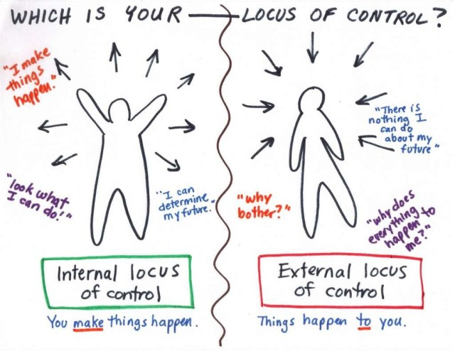

    <em>Cover photo by <a href="https://www.marketing91.com/locus-of-control/">Hitesh Bhasin</a>.
    </em>

## Introduction

Ask yourselves these questions: 

Do you think that the events in your life — getting a good or bad exam result, falling in or out of love, being happy or sad — are due to your actions or some outside power? 

At the end of the day, who do you think really controls your happiness? Who is responsible for your actions? 

The answer to these bewildering thoughts can be obtained through the understanding of an important yet little-known and understood concept in the psychological literature known as **locus of control**. 

Coined by Julian Rotter in 1954, locus (Latin for "*place*") of control is defined as an individual’s belief system regarding the causes of his or her experiences and the factors to which that person attributes success or failure. 

In other words, it refers to the **degree or extent** to which you believe you have **control** over the events that affect your life. 

This concept is divided into two categories: **internal** and **external**.

 

 

## Internal Locus of Control

**Internal locus of control** refers to people's belief of attributing their success to their *own* efforts and hard work. Meaning, you take charge and have agency in your life, how it’s up to you to make things happen and you hold yourself accountable for making changes in your own life.   

People with an internal locus of control assume a **sense of personal responsibility** and influence over what happens to them. They do not believe that **greatness is *born***, instead they believe **greatness is *made***. They feel their actions have a direct impact on their results and they accept responsibility and credit for how things turn out to be. When they face a new and unpredictable situation, they trust their ability to influence it, and so the unknown appears less daunting.

By accepting that you have the ultimate control in your life, you **accept ownership of your actions**. This means, amongst other things, that you are **self-validating**. You have no need for excuses. You’re not afraid to be open and honest about what you want or what your priorities are and you don’t worry so much about what other people think.  

The combination of competence and confidence that comes from believing you are in control of yourself and the situation can make your power to change enormous. Which is why people with high internal locus of control are often associated with being **more motivated, have higher self-esteem and efficacy**, and are **more likely to be successful achievers** in the long run.

It is not all rainbows though. When taken to the extreme, the internal orientation can become a problem. Internals can be psychologically unhealthy and unstable. They can be **very hard on themselves**. They **lack self-love** and are truly their own **worst critic**. A person with high internals can push themselves far beyond their limits, to the point of being detrimental. 

## External Locus of Control

Meanwhile, when you feel that someone or something else is in control of your existence and the things that happen to you, you have an **external locus of control**.

Externals tend to believe that their **success is often dependent on external factors** such as luck, chance, fate, unpredictability or randomness, or the consequences of actions of others around them. That, **your life happens *to you*, rather than *due to you***. It’s **independent of your hard work or decisions**. 

With such beliefs, people with an external locus of control tend to be **fatalistic**, seeing things as happening to them and that there is little they can do about it. This tends to make them **more passive, resigned, demotivated** and often **place blame on the problems faced instead**. They are more likely to develop a **sense of helplessness** and **feel powerless** while have a tendency to indulge in a** victim mentality** or behaviour such as blaming, criticising, complaining, and eventually giving up.

When your locus of control is external, you also come to **rely on outside validation**. Because you don’t believe in yourself, you end up seeking the approval of others, possibly by replying to messages as quickly as possible to impress someone or by posting photos to Instagram and "keeping score" of all the double-taps you get. 

In doing so, you give other people and external situations control over your emotional state and self-worth – and by extension, over you. You have essentially placed your identity and value in the hands of others and have prioritised the opinions and priorities of others over your own.

## Conclusion

It’s an interesting concept which I learned not too long ago. My take from this is that the locus of control shows the **type of mindset** you have, the **perspective** you may be following as well as the **choices** you are bound to make in life. This is one of the reasons why I think that the perspective of a person within a certain context is so important. 

This is not to say, however, that an internal locus of control is "*good*" and an external locus of control is "*bad*." Too much or too little of either can be detrimental. 

Bottom line is that, one should **strive to obtain a greater internal locus of control**, while still **maintain some bits of externals too**. Especially when as Muslims, we have to believe in Qada’ and Qadar and submit to Allah's will. That is why in Islam, we're taught to make effort first, followed by *du'a* and lastly *tawakkal*. 

**As always, balance is indeed the key to our existence.**