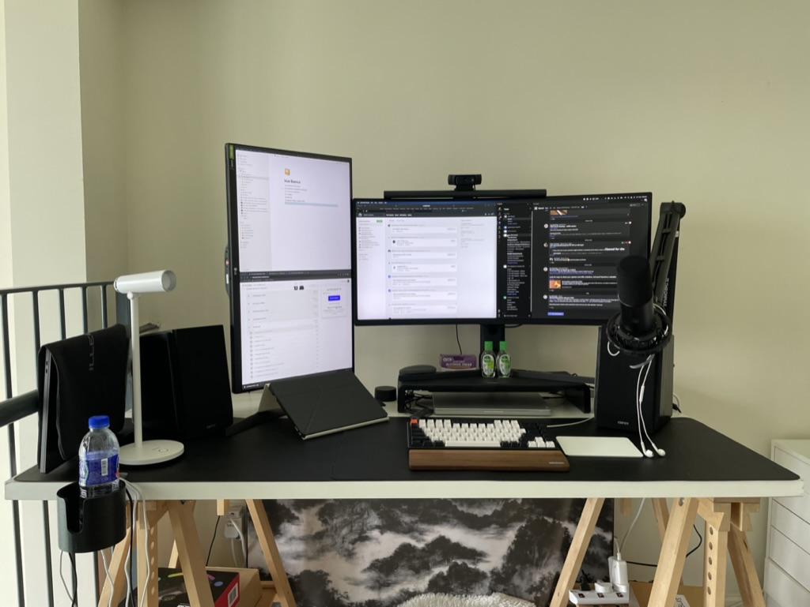
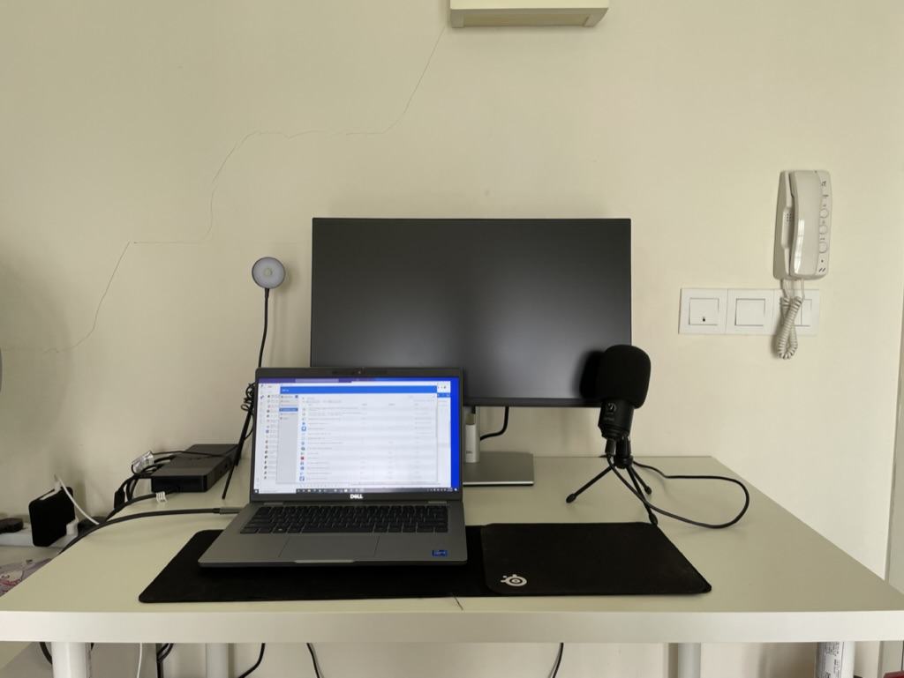

    <em>Illustration by Kelsey Wroten.</em>

## Physical Setup
 
 

    

 
 

The following are the list of peripherals I used for my main setup:

- M1 Pro MacBook Pro 14-inch (16GB RAM, 1TB Storage)
- Xiaomi 34" Mi Curved Gaming Monitor
- LG 27" 27GL850 Monitor
- 2018 iPad Pro 10.2"
- Keychron K2V2 (Hot-swappable)
- Fifine K658D Microphone
- Edifier R1855DB Speakers
- Logitech C920 Pro HD Webcam
- Apple Magic Trackpad 2
- Xiaomi Computer Monitor Light Bar

Because I work at Dell, they were also kind enough to send me a new laptop, monitor and other peripherals for my onboarding:
 
 

    

 
 

The following is the detailed look for my (technically official) work setup:

- Dell Latitude 5420 (11th Gen Intel Core i7-1185G7, 32GB RAM, 500GB NVMe SSD storage)
- Dell 24" P2422H Monitor
- Dell WS19TBS Thunderbolt Dock 
- Fifine T669 Condenser Microphone

--------------------------------

## Internal Setup

For this part, I'm only going to focus on my MacBook Pro setup as that is the one that I found myself frequently using (as of time of writing, I only use my Dell work setup to access the VPN-sensitive stuff).

Here is the list of top 20 apps that I used that really improved my user experience (in no particular order of preference):

1. [**Visual Studio Code**](https://code.visualstudio.com)
    

        
    

    - Free and open-source
    - Main IDE and code editor
    - Used the GitHub Dark theme
     
     
2. [**Notion**](https://www.notion.so)
    

        
    

    
    - Main note-taking app for self-learning
     
     
3. [**Trello**](https://trello.com)
    

        
    

    
    - Kanban board for daily task management
     
     
4. [**iTerm2**](https://iterm2.com)
    

        
    

    
    - Free and open-source
    - Replacement of macOS's built-in Terminal app
    - Arguably the best terminal emulator for macOS
    - Use it together with [Oh My ZSH](https://ohmyz.sh)
     
     
5. [**IINA**](https://iina.io)
    

        
    

    
    - Free and open-source media player software 
    - Replacement of macOS's Quicktime 
    - Look and feel better than other alternatives such as VLC
     
     
6. [**MonitorControl**](https://github.com/MonitorControl/MonitorControl)
    

        
    

    
    - Free and open-source
    - Controls your external display brightness and volume directly from your Mac
    - Sync up all your displays using a single slider or keyboard shortcuts
     
     
7. [**Min**](https://minbrowser.org)
    

        
    

    
    - Free and open-source
    - Most minimalistic browser there is
    - Useful for screen recording and demonstration
    - Personally didn't use it as often
     
     
8. [**MacDown**](https://macdown.uranusjr.com)
    

        
    

    
    - Free and open-source 
    - Best free markdown editor for macOS
    - UI is a bit outdated though
    - Personally didn't use it as often (usually just code markdown straight in VSCode using markdown extension)
     
     
9. [**iStat Menus**](https://bjango.com/mac/istatmenus/)
    

        
    

    
    - Paid app (single pay, no subscriptions) with free trial
    - Advanced and detailed Mac monitoring app
    - Easier to monitor temperature, fan speed and RAM/SSD swap usage
    - Often used by YouTubers for benchmarking and testing
     
     
10. [**Rocket**](https://matthewpalmer.net/rocket/)
    

        
    

    
    - Free with limited features (e.g not all emojis included, cannot change emoji colour)
    - Makes typing emoji faster and easier using Slack-style shortcuts instead of manually opening the built-in emoji window and search for the right emoji
    - Just start typing an emoji like :thumbsup: (👍) and Rocket will help auto-complete it – in any app
     
     
11. [**Slidepad**](https://matthewpalmer.net/rocket/)
    

        
    

    
    - Paid app ($12.99) with 30-day free trial
    - A slide over browser
    - Good for multitasking without dedicating a space for your browser on your screen all the time
    - Maybe not as good as Alfred (see next app)
     
     
12. [**Alfred 4**](https://www.alfredapp.com)
    

        
    

    
    - Free with most of the essential features available (pay for powerpacks)
    - An award-winning app for macOS which boosts your efficiency with hotkeys, keywords, text expansion
    - Replacement for macOS's Spotlight
     
      
13. [**App Cleaner**](https://freemacsoft.net/appcleaner/)
    

        
    

    
    - Totally, 100% free
    - As the name states, it allows you to *thoroughly* uninstall unwanted apps unlike macOS' built-in
     
     
14. [**Visual Paradigm**](https://www.visual-paradigm.com)
    

        
    

    
    - Free option for Community Edition with most of the essential features available
    - Arguably the best UML diagram design app ever (better than draw.io and LucidChart, no offense to some of my peers 😛)
    - Highly recommended for CS students
     
      
15. [**Rectangle**](https://rectangleapp.com)
    

        
    

    
    - Totally, 100% free
    - Move and resize windows in macOS using keyboard shortcuts or snap areas
    - Free alternative to some paid alternatives such as BetterSnapTool and Magnet (shame macOS still doesn't have this built-in)
     
      
16. [**Flotato**](https://www.flotato.com)
    

        
    

    
    - Free with limited features (e.g. can open only 1 app at a time)
    - Allows you to add web pages (especially those with no equivalent native app) to your Mac dock as built-in-ish apps
    - Helps declutter your browser
    - Use it for Twitter and Netflix
     
      
17. [**Expenses**](https://apps.apple.com/us/app/expenses-spending-tracker/id1492055171)
    

        
    

    
    - Free with most of the essential features available (one-time pay for sync across multiple devices)
    - Expenses tracking and management app
    - Clean, elegant design and functionality are really refreshing in today's sea of "do everything for everyone" apps
     
      
18. [**Cheatsheet**](https://www.mediaatelier.com/CheatSheet/)
    

        
    

    
    - Totally, 100% free
    - Allows you to hold the ⌘-Key a bit longer to get a list of all active shortcuts of the current application
    - Useful for complex apps with many shortcuts such as Premiere Pro
     
      
19. [**Folx**](https://www.mac-downloader.com)
    

        
    

    
    - Free with near-complete features (but optional to pay for Pro version)
    - Powerful and easy-to-use Torrent download manager for Mac for all pirates out there
     
      
20. [**CleanMyMac X**](https://macpaw.com/cleanmymac)
    

        
    

    
    - Paid app (one-time pay with no subscriptions) on per device basis with free trial (limited features e.g. limit on how many GBs to clean)
    - Purchased mine with student discussed
    - Most popular all-in-one package for cleaning and tidying up your Mac
     
      