**No one saw it coming.**

One minute, I was chairing the post-mortem meeting with my residential college project’s high committee members. The next, shocks and gasps filled the air quickly followed by dead silence as everyone’s eyes are fixed on the announcement made by the then Prime Minister on our phones while trying to process what was about to transpire in the next few days. There were goosebumps everywhere as if it wasn’t enough that we were already shivering from the cool blow of the air-conditioner.

Out of nowhere, everything that we’ve planned for the next few days, weeks and months will have to grind to an absolute halt. Residential college and faculty projects, university events, exams; you name it. We only have a matter of days before the Movement Control Order (MCO) (or Restricted Movement Order; I recalled it has _many_ names at the time) takes effect. Before we know it, the meeting was abruptly adjourned and everyone began rushing to make preparations to return home. I immediately browsed through the airline fares to Kuching and the prices have already skyrocketed, possibly indicating that the industry might have had an early brief.

Not long after, my phone rang. With a concerned tone, my mother asked whether I’m aware of the news and if I plan to return. After taking into account the flight cost, the hassle to pack everything up last minute and the assumption that this will _just_ be a short-term and temporary measure, I decided to **stay**.

That decision will mark the beginning of one of the most challenging phases of my life, and how I survived it.

Fast-forward a few days, and what was once a bustling and eventful residential college quickly turned deserted, where much of its inhabitants had left. Shoes which are often disorderly line up the hallway, only a few remain. All 2 of my roommates have departed home. Little did I know at the time that the few days prior will be the last time I’ll see not just them, but many of my friends and peers face-to-face.

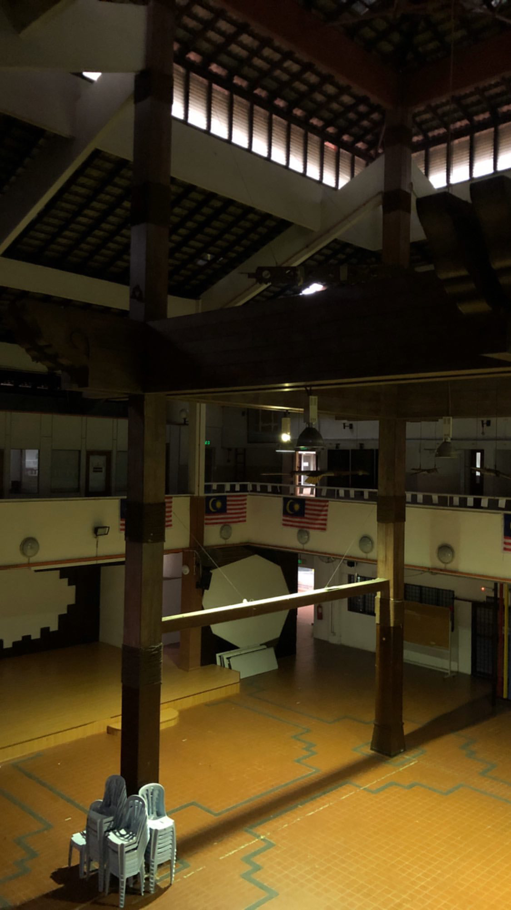
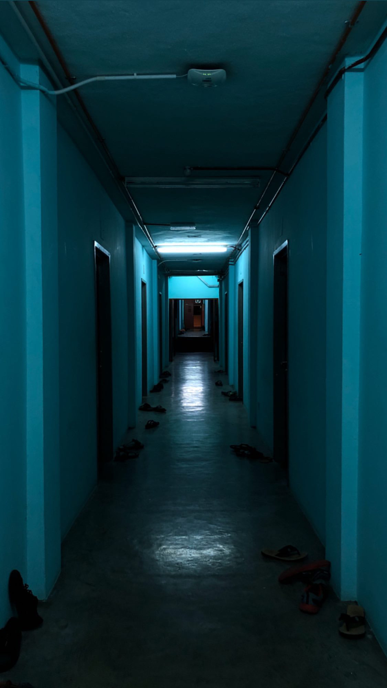

When the university announced the postponement of the semester until the end of April by the Ministry of Higher Education’s recommendation, everyone was elated at first. I mean, who _doesn’t_? The first few weeks of this academic hiatus were spent binge-watching Netflix shows and playing online games with some of my friends via Discord. I also get to play songs and music on my Spotify playlist in full blast since no one else is in the room; something I’ve been _dying_ to do. Deep down, all these leisures and sudden sedentary lifestyles were coping mechanisms for accepting the reality that everything that I have planned for my sophomore year ended up in ruins.

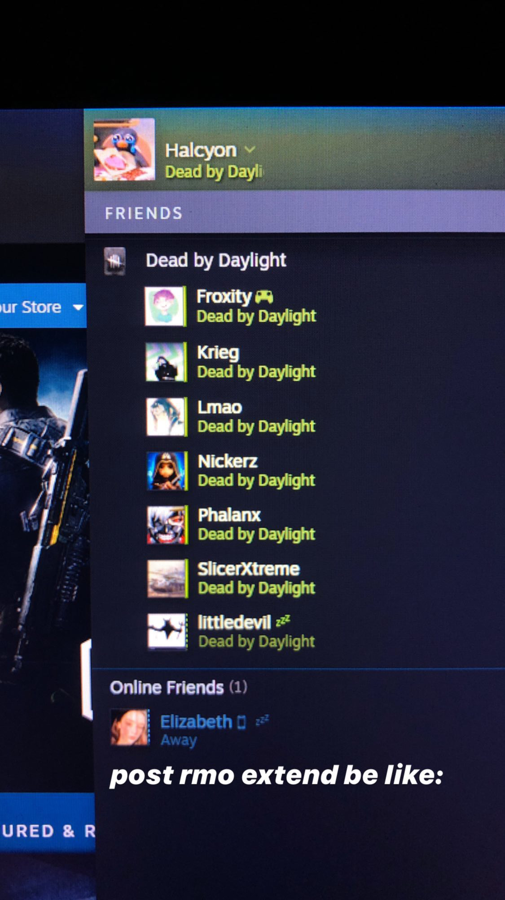

In some ways, it felt weird and almost borderline _illegal_ to be able to slack off this much in the middle of the semester.

However, as a self-proclaimed workaholic (now recovering), I couldn’t get used to being unproductive for long periods. Thus, after all the fun is over, I decided to work on my assignments in advance; a decision I’m forever grateful to my past self as I don’t think I would’ve performed well academically for that semester if it chose otherwise.

They say that your 21st birthday has special significance since it marks your ‘_coming of age_’. It’s the reason why _Forever 21 \_is named such by its founder Do Wan Chang as he considered 21 to be “\_the most enviable age_”. So naturally, I have set out some high expectations for myself. But, never would I have imagined that I will be celebrating said milestone in the middle of lockdown, alone in my room. It was sombre indeed, but fortunately, I received a surprise from both my family and some of my remaining friends in the college which made things bearable.

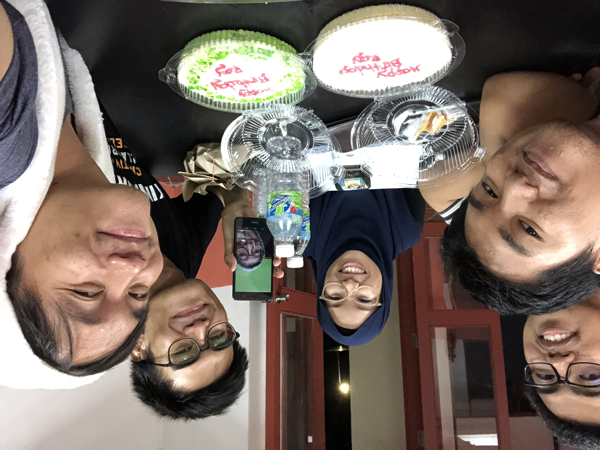
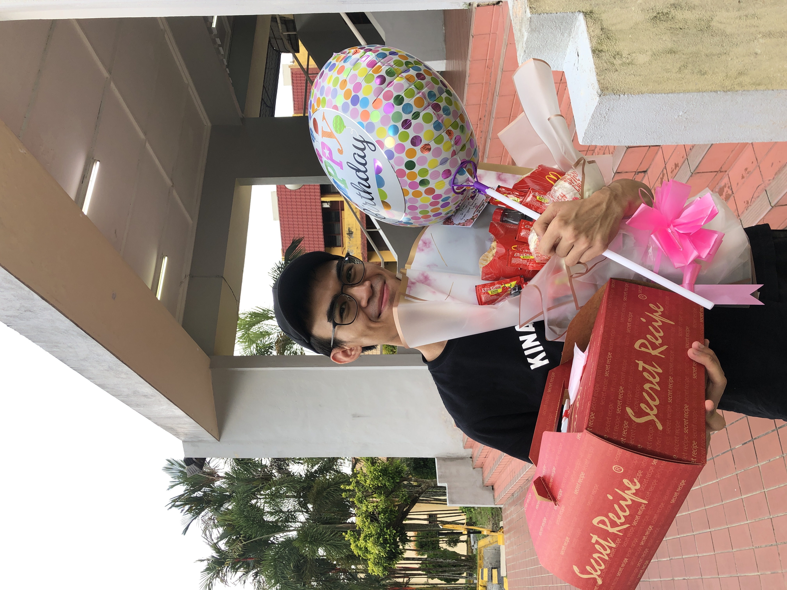

As an introvert, being able to spend time alone is a _huge_ blessing. But what I didn’t know at the time was that loneliness can become overwhelming for anyone at some point. No matter how introverted you are, you have to admit that we human beings are inherently and intrinsically social creatures. Hence why social distancing brought out by the pandemic can be so hard for people in general, as it’s contrary to our very nature.

Without going into detail, it suffices to say that my mental health took a dive upon entering the second month of seclusion. In case you don’t know, I went through all but the last day of Ramadan almost entirely in lockdown on campus. I remember breaking into tears when I break my fast alone in my room, realising just how miserable and pitiful my situation was as well as thinking of the prospect that I might not be able to spend _Eid_ with my family for the first time in my life. Eventually, I ran out of things to do to serve as distractions which only fuelled the sadness. It doesn’t help the fact that some of my friends started returning home one by one when the government and university announced a coordinated operation in sending those stranded on campus back home, a few at a time. I was counting the days to when will it be my turn before homesickness overwhelmed me for good.

Then, in early May, I received an SMS from the UM COVID-19 task force indicating that I’d been among those shortlisted for a MAS flight trip back to Kuching. The feeling of getting the text was akin to knowing that you passed a work interview. We were required to attend a briefing at _Dewan Tunku Canselor_ the following day on the necessary preparations and instructions, despite my flight being in a fortnight. I recalled having to do a swab test and medical checkup at the university clinic and filling out a bunch of forms. The worst part however is the packing of luggage, which made me realise just how much stuff I brought with me which was soon followed by regret.

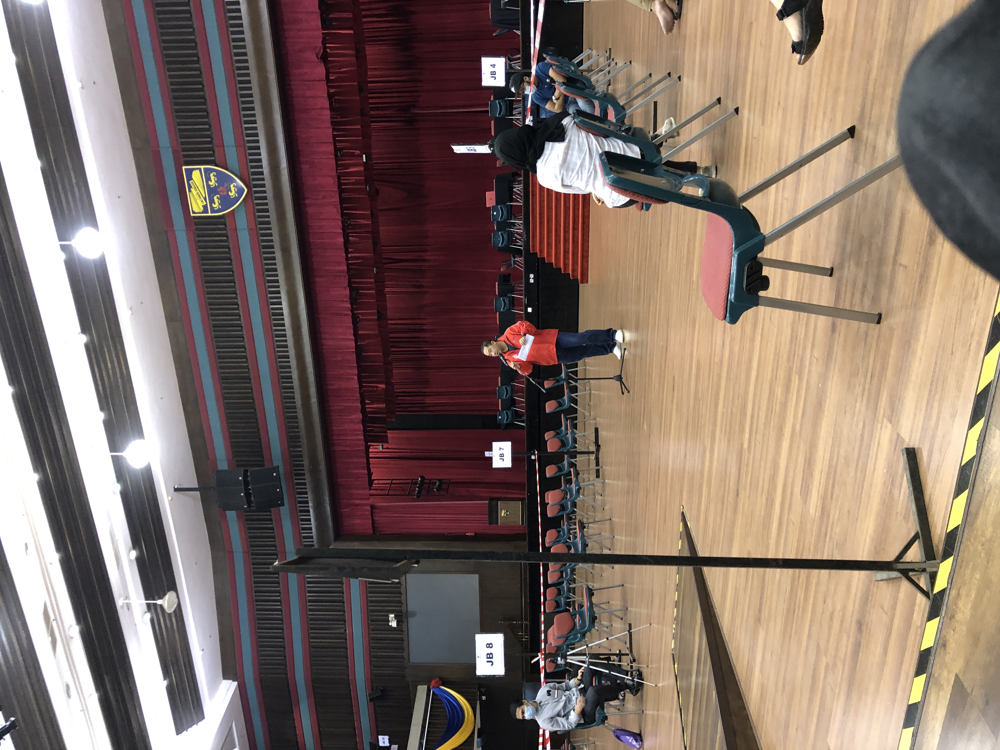
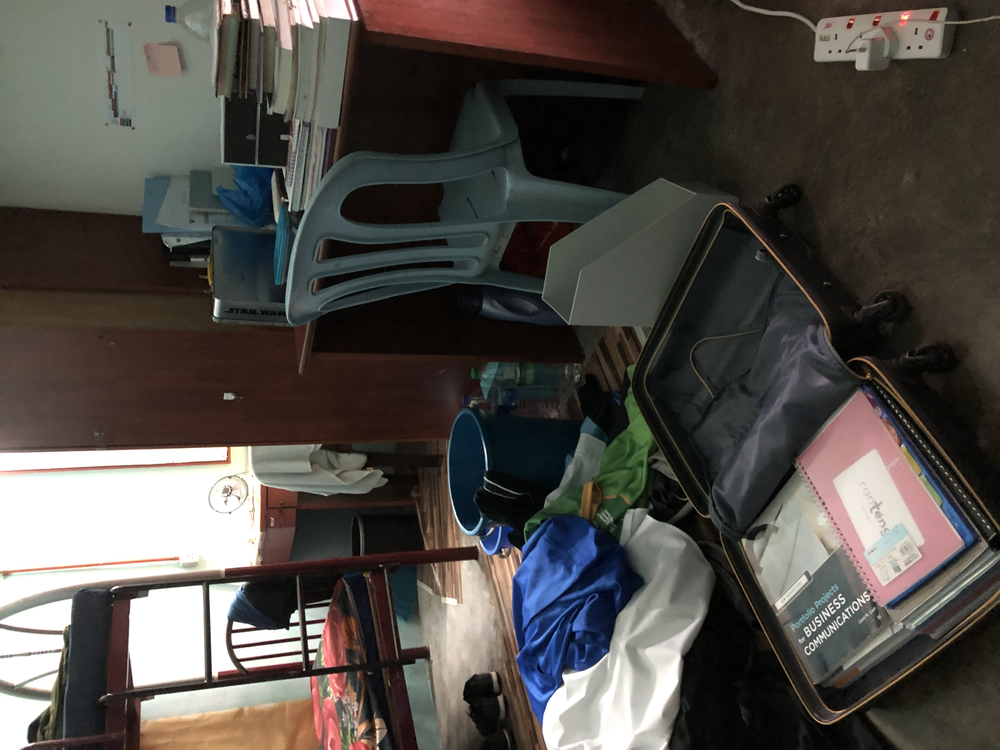

Fast-forward two weeks later, and it was finally time. The day before, I packed all my study notes and put them on my roommate’s desk together with a handwritten letter bidding him goodbye for him to bring along once he returns to pack his stuff.

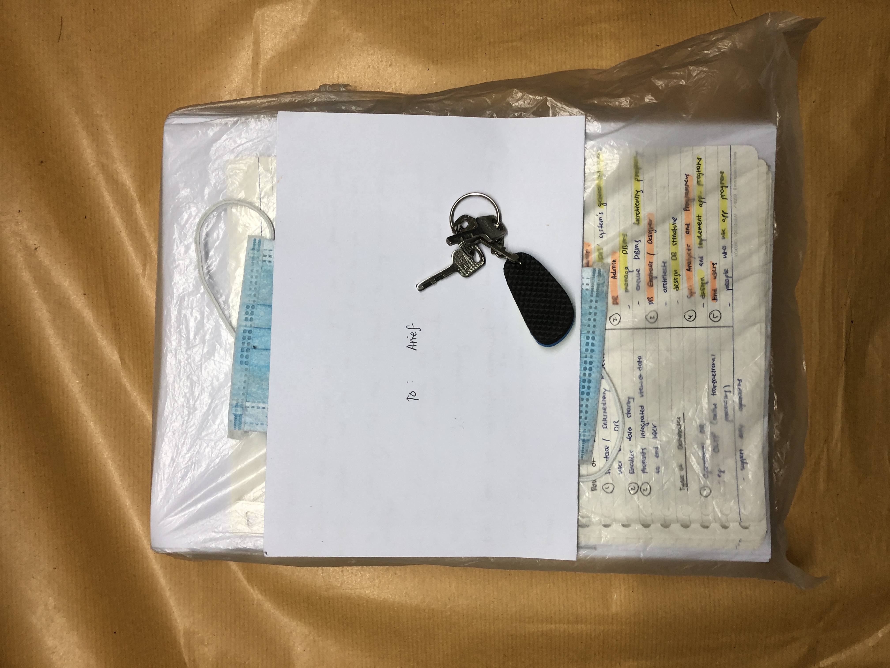
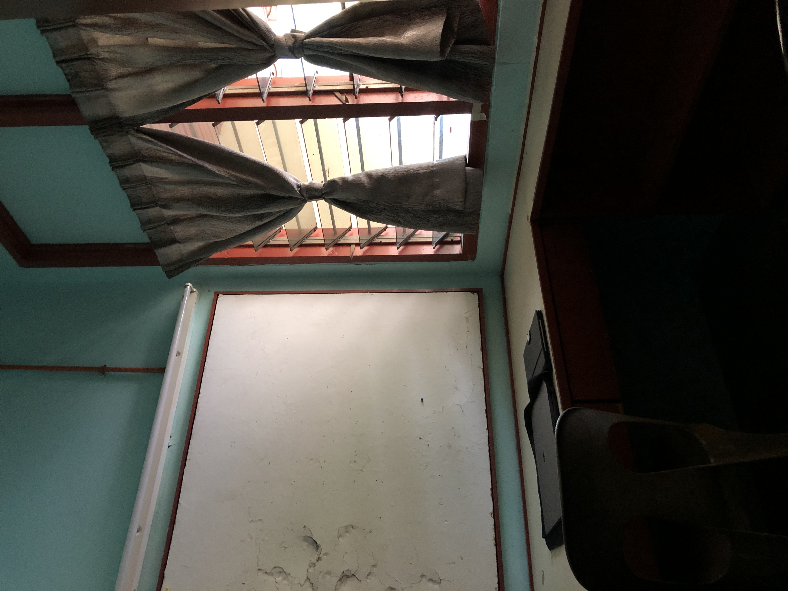

Knowing I most likely won’t set foot there again for a long time, I went to the roof of my block and took this rather dramatic photo which aptly describes the hodgepodge of feelings I had; a mix of relief knowing I’m finally able to return home and sorrow realising I may never set foot here again.

We first gathered at the bus stop in front of our respective colleges around 2:00 AM for the bus to pick us up and gather for yet another briefing which only started two hours later. I barely had enough sleep that night due to the excitement I was feeling. Roughly at 4:30 AM, we were on the move once again in busses en route to KLIA whilst escorted by police. Because we’re not allowed to exit the bus unless for emergency purposes, we Muslims had to perform our morning _Subuh_ prayer whilst seated on the bus (it’s called _rukhsah_ or concessions).

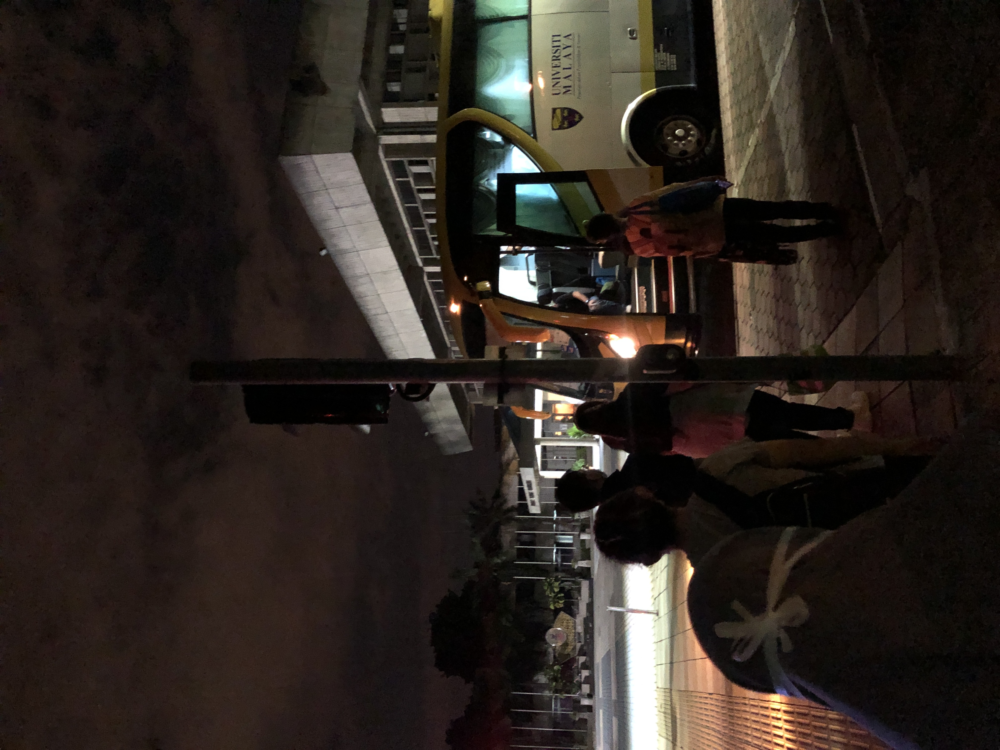
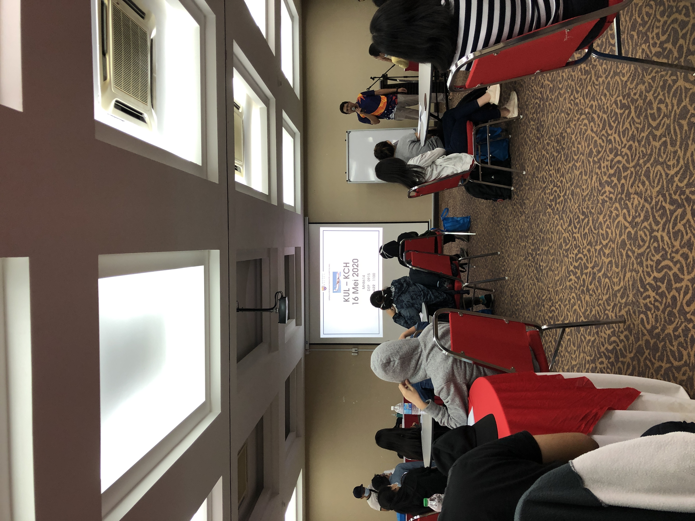

We arrived at KLIA at 7:00 AM sharp. Because I have so much luggage to bring along, I had to pay extra (around RM100-200) which I didn’t mind because all I cared about is to just getting myself and my stuff safely back home. At the time, there was also a special health declaration form that needs to be filled out before entry to Sarawak thanks to the state flexing its immigration powers.

  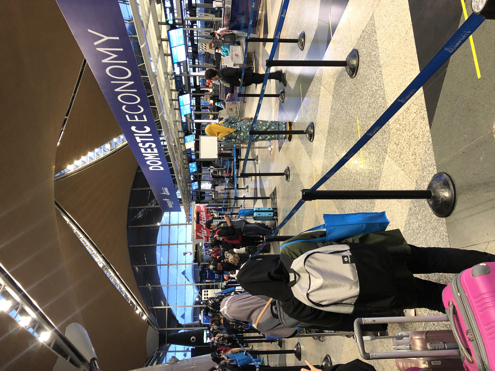
  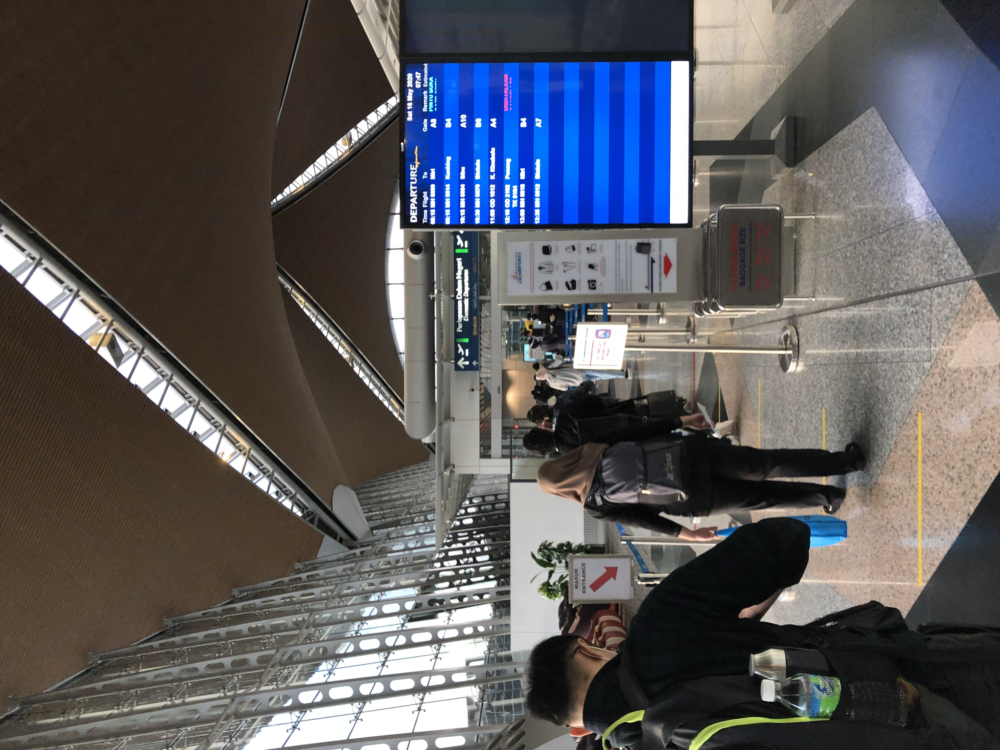
  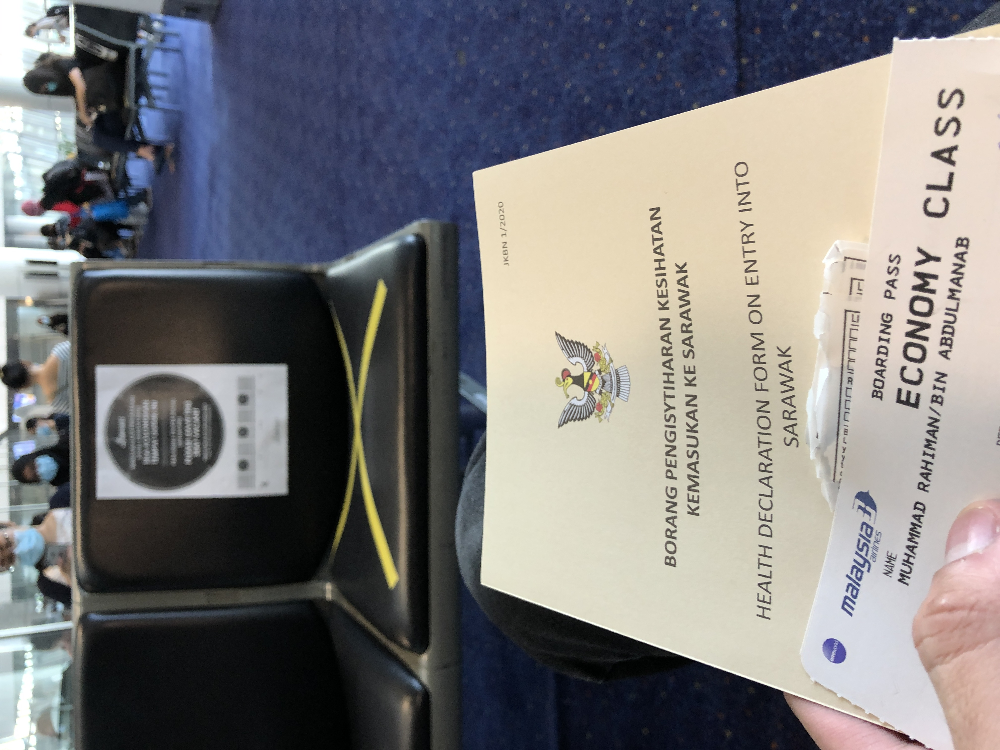

The flight took off at 9 and landed safely in Kuching around 11. I think I spent nearly 2 hours at the airport alone due to all sorts of business from retrieving my luggage, immigration clearance, yet another round of swab test and finally getting sorted on the bus to be sent to our respective quarantine centres for a 14-day quarantine. I managed to briefly meet my parents who came to the airport to pick up some of the luggage that I won’t be bringing along with me. I was on the verge of tears trying to break the urge to hug them as we weren’t allowed to make any form of contact with anyone else outside of our group. 

  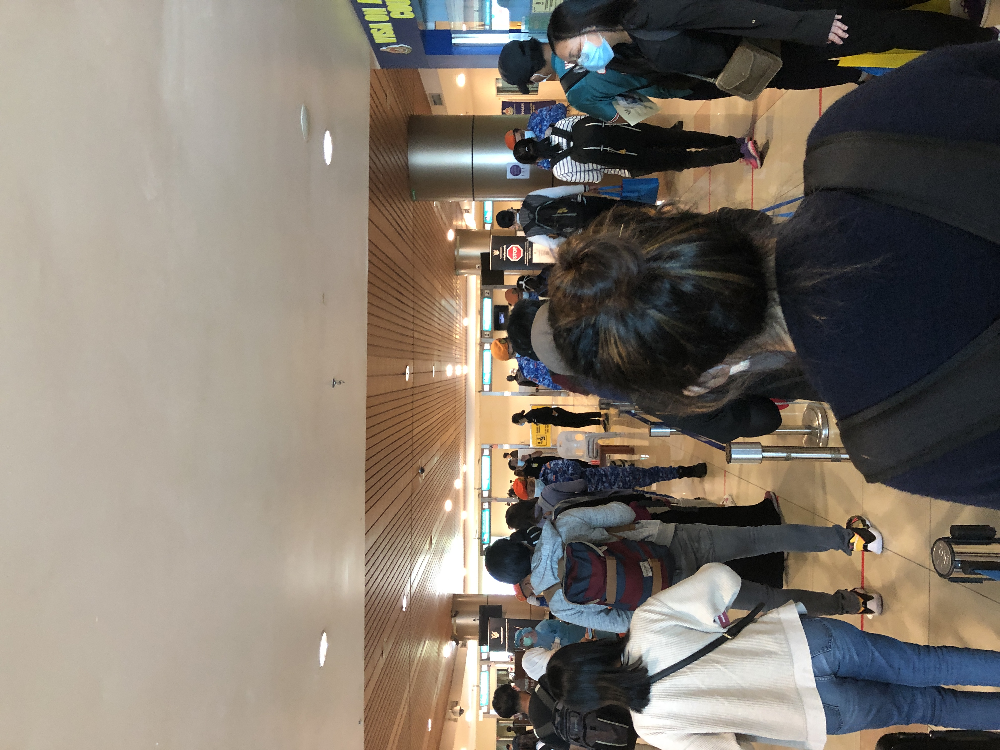
  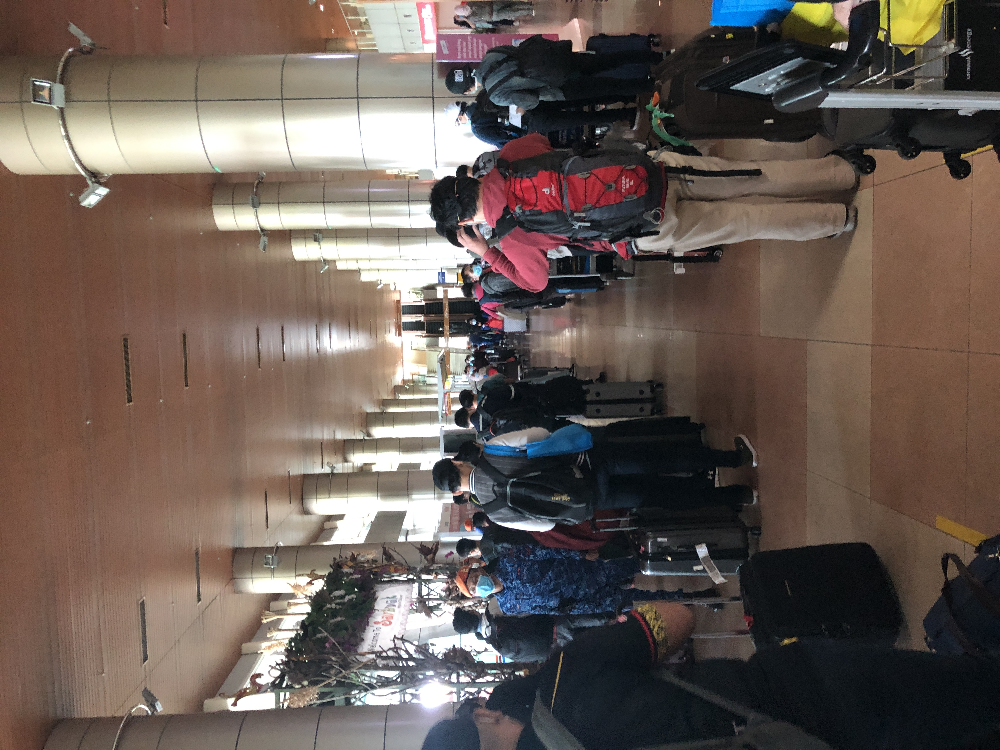

While on the bus, I looked at the surroundings and noticed just how quiet and deserted the once bustling city was. Deep down, I was praying that I got to stay at a nice hotel for my quarantine. Fortunately, my prayers were answered as my group was assigned to the Hilton Hotel. Upon arrival, we had to ditch our bags to be gathered in a hall for yet another briefing and a bunch of forms to fill out and submit (_I already got used to it at that point_). 

  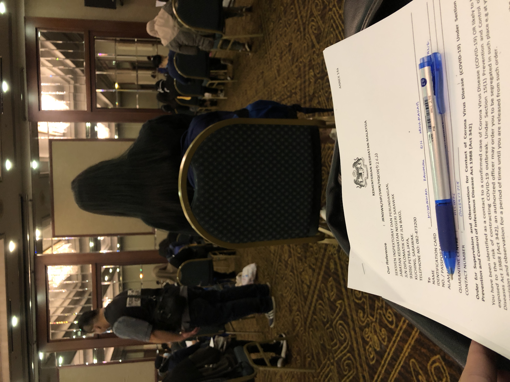

During the briefing given, we were told that each room will consist of a maximum of 2 people and we need to find our partners ourselves. It was giving me freshman year orientation vibes. But, lucky for me, a high school friend of mine was also on the same flight, bus and staying in the same hotel as me. We quickly paired up and checked into our hotel room, which was surprisingly (or rather _unsurprisingly_) more luxurious and spacious than we expected along with a nice view of the city’s waterfront. 

  

Apart from going through 2 rounds of swab tests and surviving online classes which _finally_ resumed not long after we arrived, the 14 days of quarantine had nothing eventful to talk about. The food was decent, but I occasionally asked my parents to drop some snacks or food for the hotel staff to deliver to each room at certain times of the day. Other than that, it was just a waiting game essentially. 

  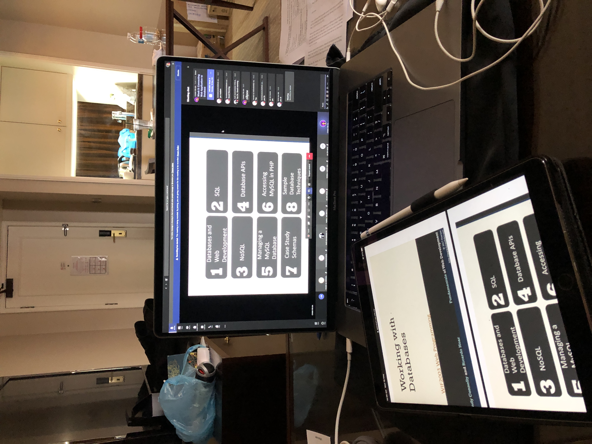

After getting discharged, we were required to wear a tag on our wrist and update our location through the designated government site twice a day. I was so happy to be able to finally meet my parents and family after what seemed like an eternity even though it was just a few months. Time really is funky as hell when you’re not in a pleasant situation. 

  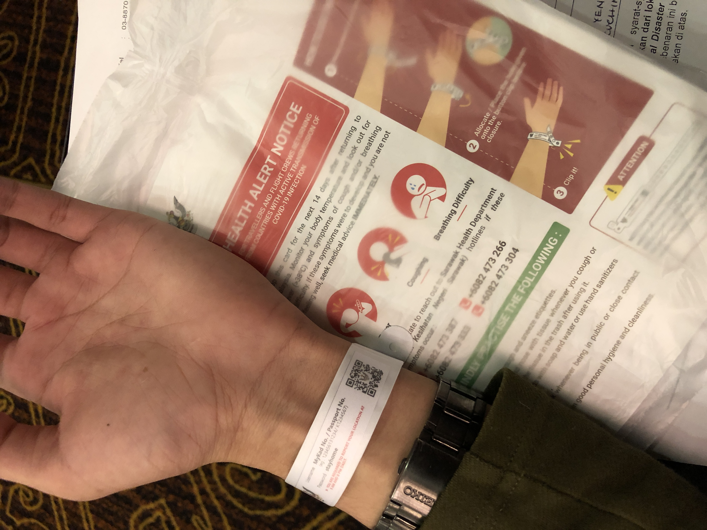

Speaking of time, the timing of my discharge couldn’t be more perfect. I got to experience the final day of fasting with my family and celebrate _Eid_ with them the following day. During the _Eid_ supplementary morning prayer led by my father which we performed at home instead, he cried at the end stating how grateful he was that I was able to reach home on time. Although we couldn’t celebrate _Eid_ as merrily as we used to, it was still one of a kind and one to remember.

So, folks, that’s the story of how I survived 60 days of near solitary confinement. Looking back, I learned a lot about myself throughout the life-changing journey and I’m proud of how I managed to **triumph over the pandemic**.
